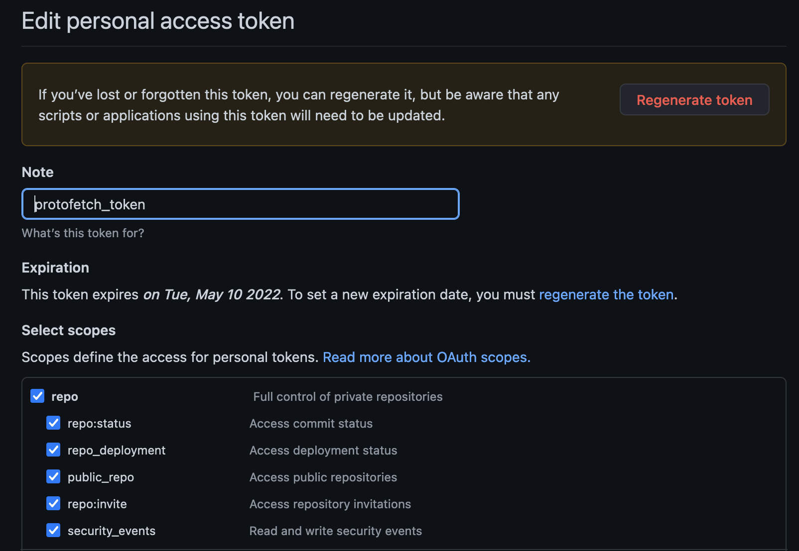

# Protofetch

[](http://www.apache.org/licenses/LICENSE-2.0)
[](https://crates.io/crates/protofetch)
[](https://www.npmjs.com/package/cx-protofetch)


A source dependency management tool for Protobuf files.

## Motivation

If you use protobuf extensively as a data format for services to communicate with or to share your APIs with the outside world,
you need a way to get correct versions of protobuf files for each service and ability to depend on a specific version. 
This is needed on both server and client side. 
Without automation, it can quickly become cumbersome, error-prone and overall unmanageable.

To make it bearable, usable and stable, one needs tooling that automates this work and makes it predictable. This is what Protofetch aims to do.

## Why Protofetch?

Protofetch aims to tackle the complexity of handling protobuf dependencies in a declarative fashion.
It makes it trivial to declare dependencies and to manage them.

It gives you the ability to have:
* dependency on specific version/hash;
* predictable builds/test/CI that depend on protobufs;
* easy to read declarative specification of protobuf dependencies;
* automate fetching of the dependencies themselves with their transitive dependencies.
* caching of dependencies so that they can be shared across multiple projects.

## Roadmap

This project is still under development and is subject to change in the future.
We aim to achieve at least the following goals before releasing the first stable version.

- [x] Fetch dependencies based on git tag or branch
- [x] Cache dependencies locally by revision
- [x] Fetch transitive dependencies
- [x] Declarative rules per dependency
  - [x] Allow policies 
  - [x] Deny policies
  - [x] Dependency pruning (remove `proto` files that are not needed)
- [ ] Prevent circular dependencies

## Getting Started

Protofetch is being released to cargo so to use it you can directly download the crate from the [crates.io](https://crates.io/crates/protofetch)
and install it with `cargo install protofetch`.

### Usage

```sh
   # -f forces lock file to be generated in every run
   protofetch fetch -f
   
   # For just lock file generation
   protofetch lock
  ```

## Protofetch module

Each service using protofetch will require a module descriptor which uses `toml` format.
This descriptor is by default called `protofetch.toml` and is located in the root of the service's repository.
This can be changed, but it is heavily discouraged.

| Field         | Type         | Required  | Description                                                                |
|---------------|:-------------|:----------|:---------------------------------------------------------------------------|
| name          | String       | mandatory | the name of the defined module                                             |
| description   | String       | Optional  | the description of the module                                              |
| proto_out_dir | String       | Optional  | the path to write the proto files to, relative to where the command is run |
| dependencies  | [Dependency] | Optional  | The dependencies to fetch                                                  |

### Dependency format

| Field          | Type     | Required  |                                     Description                                     |                                           Example |
|----------------|:---------|:----------|:-----------------------------------------------------------------------------------:|--------------------------------------------------:|
| url            | String   | mandatory |               the address of the repo to checkout protobuf files from               |              "github.com/coralogix/cx-api-users/" |
| revision       | String   | Optional | the revision to checkout from, this can either be a tagged version or a commit hash |                                              v0.2 |
| branch         | Boolean  | Optional  |  branch can be used to override revision for testing purposes, fetches last commit  |                                        feature/v2 |
| protocol       | String   | mandatory |                            protocol to use: [ssh, https]                            |                                               ssh |
| allow_policies | [String] | Optional  |                                 Allow policy rules.                                 | "/prefix/*", "*/subpath/*", "/path/to/file.proto" |
| deny_policies  | [String] | Optional  |                                 Deny policy rules.                                  | "/prefix/*", "*/subpath/*", "/path/to/file.proto" |
| prune          | bool     | Optional  |                   Whether to prune unneded transitive proto files                   |                                       true /false |
| transitive     | bool     | Optional  |                         Flags this dependency as transitive                         |                                       true /false |


### Protofetch dependency toml example


```toml
name = "repository name"
description = "this is a repository"
proto_out_dir = "proto/src/dir/output"

[dep1]
protocol = "https"
url = "github.com/org/dep1"
revision = "1.3.0"
prune = true
allow_policies = ["/prefix/*", "*/subpath/*", "/path/to/file.proto"]

[dep2]
protocol = "ssh"
url = "github.com/org/dep2"
revision = "5.2.0"
branch = "feature/v2"

[another-name]
protocol = "ssh"
url = "github.com/org/dep3"
revision = "a16f097eab6e64f2b711fd4b977e610791376223"
transitive = true
```

## HTTPS support

If you want to use https you need to specify credentials using one of the following:

- User/pass parameters;
- Environment variables `GIT_USERNAME` and `GIT_PASSWORD`;
- System-wide configuration `.gitconfig` file;


To support https when `2FA` is enabled you must generate a personal access token and set it as the password.
The following permissions are sufficient when creating the token.



## Transitive dependency support and pruning

Protofetch supports pulling transitive dependencies for your convenience. 
However, there is some manual work involved if the dependencies do not define their own protofetch module.

In a situation where A depends on B, you should flag that dependency as transitive.

This is helpful especially when you take advantage of the pruning feature which allows you to only recursively fetch 
the proto files you actually need. With pruning enabled, protofetch will recursively find what protofiles your root 
protos depend on and fetch them for as long as they are imported (flag as transitive dependency or fetched from other modules).

Moreover, you can also use the allow_policies to scope down the root proto files you want from a dependency. 
As an example, the following module depends only on A's file `/proto/path/example.proto` but since pruning is enabled and 
B is flagged as transitive, if the allowed file has any file dependencies it will pull them and its dependencies, recursively.

IMPORTANT: If you are using the `prune` feature, you must also use the `transitive` feature. However, do not use transitive
unless you strictly want to pull the transitive dependencies. This is a workaround for dependencies that do not define
their protofetch file on their repo.

```toml
name = "repository name"
description = "this is a repository"
proto_out_dir = "proto/src/dir/output"

[A]
protocol = "https"
url = "github.com/org/A"
revision = "1.3.0"
allow_policies = ["/proto/path/example.proto"]
prune = true

[B]
protocol = "ssh"
url = "github.com/org/B"
revision = "5.2.0"
branch = "feature/v2"
transitive = true
```
